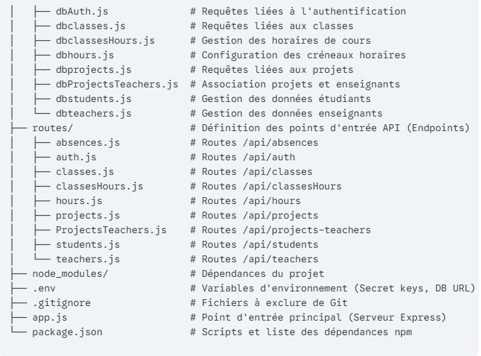

# Gestion des Absences - Backend

Ce projet est le backend pour l'application de gestion des absences.

## Installation

1.  **Cloner le dépôt**
    ```bash
    git clone https://github.com/Pang-Jaruphong/GestionAbsences.git
    ```

2.  **Accéder au dossier du backend**
    ```bash
    cd GestionAbsences/Backend
    ```

3.  **Installer les dépendances**
    ```bash
    npm install
    ```

4.  **Configurer l'environnement**  
    Créez un fichier `.env` à la racine du dossier `Backend` et ajoutez les variables suivantes pour la connexion à la base de données :
    ```
    DB_HOST=votre_host
    DB_USER=votre_utilisateur
    DB_PASSWORD=votre_mot_de_passe
    DB_NAME=votre_nom_de_base_de_donnees
    ```
5. **Base de données**  
    Dans un client SQL, exécuter les fichiers:  
    ./Doc/BD/NewAbsenceClassePW.sql  
    ./Doc/BD/NewInsertAbs.sql


6. **Démarrer le serveur**  
    Ajoutez le script `"start": "node app.js"` dans package.json pour préciser le point d'entrée
    ```bash
    npm start
    ```
    Le serveur sera lancé sur `http://localhost:4000`.

## Structure du projet



## Dépendances

-   `bcrypt`: Hachage des mots de passe.
-   `cors`: Gestion des autorisations Cross-Origin Resource Sharing.
-   `dotenv`: Gestion des variables d'environnement.
-   `express`: Framework pour l'application web.
-   `mysql2`: Client MySQL pour Node.js.
-   `nodemon`: Redémarrage automatique du serveur lors des modifications.

## Routes de l'API

| Méthode | Endpoint                               | Description                                                 |
|:--------| :------------------------------------- |:------------------------------------------------------------|
| `GET`   | `/`                                    | Message de bienvenue du service.                            |
| `POST`  | `/auth/login`                          | Connexion d'un enseignant.                                  |
| `POST`  | `/auth/register`                       | Inscription d'un nouvel enseignant.                         |
| `POST`  | `/auth/createPW`                       | Création du mot de passe lors de la première connexion.     |
| `GET`   | `/absences`                            | Récupérer toutes les absences.                              |
| `GET`   | `/absences/students/:id`               | Récupérer les absences d'un étudiant par son ID.            |
| `GET`   | `/absences/Classes/:id`                | Récupérer les absences d'une classe par son ID.             |
| `GET`   | `/classes`                             | Récupérer toutes les classes.                               |
| `GET`   | `/classesHours`                        | Récupérer les liens entre classes et heures.                |
| `GET`   | `/hours`                               | Récupérer toutes les plages horaires.                       |
| `GET`   | `/projects`                            | Récupérer tous les projets.                                 |
| `GET`   | `/projectsTeachers`                    | Récupérer les liens entre projets et enseignants.           |
| `GET`   | `/projectsTeachers/groupes/:id`        | Récupérer les informations d'un groupe de projet par ID.    |
| `GET`   | `/projectsTeachers/projects/absences/:id`| Récupérer les absences liées d'un projet par son ID.        |
| `GET`   | `/projectsTeachers/projects/stats/:id` | Récupérer les statistiques d'absence pour un projet par ID. |
| `GET`   | `/students`                            | Récupérer tous les étudiants.                               |
| `GET`   | `/students/classes/:id`                | Récupérer les étudiants d'une classe par son ID.            |
| `GET`   | `/teachers`                            | Récupérer tous les enseignants.                             |
```